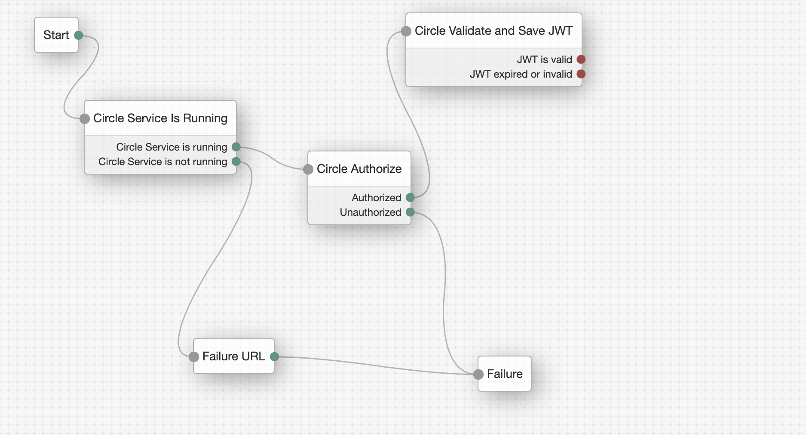
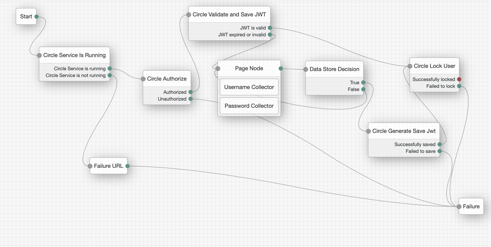
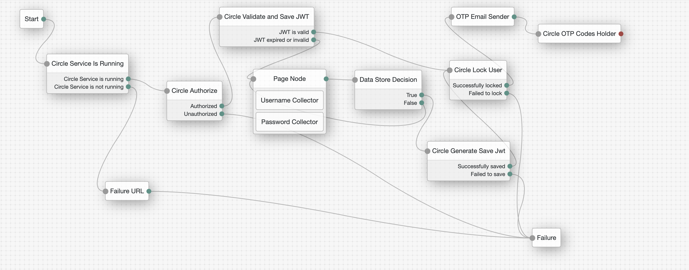

<!--
 *
 * Copyright 2021 Circle.
-->

# Circle API
 
Circle is a revolutionary data security and credential-free authentication API that enables developers and Enterprise IT to easily integrate unrivaled security, identity authentication and privacy protection capabilities into their applications as a single unified API.  Circle’s initial integration with Forgerock powers the following capabilities as a turn-key solution for Forgerock customers.
 
1. Cryptographic Credential-free Authentication.  Replaces password-based log-ins with a cryptographic method of storing secrets – or at the highest level, cryptographic signatures – that uniquely restrict and bind authentication to log-in to any cloud resource to the specific user and device that has been authorized. 
 
2. Circle of Trust Human-in-the-Loop Identity Verification + Authentication.    Provides the option to escalate to ultra-secure distributed, peer-to-peer multifactor identity verification + authentication when needed for high risk use cases, contexts and user profiles.  
 
Benefits include:
 
1. Zero trust authentication that is cryptographically fused to your device and requires no passwords, usernames or any credentials.
 
2. Eliminate phishing and any other threats from stolen or lost credentials.
 
3. Works across browsers, devices and contexts.
 
4. Unlike cookies, which can be copied or modified, objects or files stored inside the Circle Service can not be accessed or changed.
 
## Circle Nodes Required for ForgeRock

You need Circle Service node collection for ForgeRock Identity Platform version 7.1.0 or above.  

## Getting Circle Credentials
Please visit <a href="https://gocircle.ai">https://gocircle.ai</a> to get credentials and download Circle Service.
 

## Installation
Copy the .jar file from the `../target` directory into the `../web-container/webapps/app-name/WEB-INF/lib` directory where AM is deployed.  Restart the web container to pick up the new nodes.  The nodes will then show up as tree components.

## To Build
run **mvn clean install** in the directory containing the `pom.xml`.

## Flows 
There are 2 different flows. Each flow represents a ForgeRock Authentication Tree.

# Authentication Flow
The authentication flow performs the following operations:

- Verifies if the service is running locally.

- Authorizes the Circle Service by retrieving an authorization token from the Circle servers.

- Checks if a JWT (JSON Web Token) is stored inside the Circle Service. If so, it checks that the signature is not expired. Then it reads the username stored inside the token and stores it in **sharedState** for the next node.

- If the JWT does not exist, it redirects the user to the username and password sign-in flow.

- Once the credentials are validated, it generates a JWT, stores it securely in the Circle Service, and again puts the username into **sharedState** for the next node.

## Circle Service is Running Node
This node checks if the Circle Service is running on the local machine.

If the Circle Service is not installed, the user is redirected to the Circle installation page.

Once the installation is complete, the user is automatically redirected back to the authentication flow.

Use a regular **Failure URL** node with the following content:

https://internal.gocircle.ai/api/installers/?return_url=<YOUR_SERVICE_URL>

The **return_url** parameter must point to the URL of the service execution. It must specify the realm and the service name. The parameter must be an encoded URL. 
 
In this example, it looks like this:

`https://internal.gocircle.ai/api/installers/?return_url=https%3A%2F%2Fforgerock.gocircle.ai%3A8043%2Fam%2FXUI%2F%3Frealm%3Dcircle%26service%3Dauthentication`

A helper tool for encoding URLs can be found on this <a href="https://www.urlencoder.org/" target="_blank">page</a>.

### The node responds with either:

- Circle Service is Running 
- Circle Service is not Running

## Circle Authorize Node
This node authorizes the Circle Service by getting a token from the Circle servers. The token is added to the sharedState and passed to the **all other circle nodes**.

### The node responds with either:
- Authorized   
- Unauthorized

### Node settings
- **App Key** API key
- **Secret** API secret
- **Customer Code** customer code assigned at developer signup
- **API URL** the default Circle API URL

 
## Circle Validate and Save JWT Node
This node checks if a JWT (JSON Web Token Authentication) is stored in Circle and whether it is valid and not expired. 
 
If the token is valid, the username stored in the token is read and stored in the sharedState for the next node.

### Node settings
- **Secret** The Secret provided by Circle upon registration

### The node responds with either:
- JWT is valid
- JWT expired or invalid
 
## Circle Generate Save JWT Node

This node reads the **username** from the sharedState, creates the JWT with the secret, and stores it in the Circle Service.

### Node settings
- **Secret** The Secret provided by Circle upon registration
- **Expiry time (days)** The token expiration time in days
fig
### The node responds with either:
- Successfully saved
- Failed to save

# Reauthentication Flow

This flow demonstrates a scenario where users can be locked (and their **locked state** in this Circle) until they enter the correct lock codes to be unlocked.
 
For example, it is possible to lock the user and generate unlock codes that can be sent to the administrator's email and/or SMS. The user must then contact the administrator to obtain the unlock codes.

The process starts the same way as the authentication flow. Nodes are added to lock and unlock the user.

## Circle Lock User Node
This node locks the user and stores the unlock codes in the **transientState**.

### Node settings
- **Circle Private Key** Private key received upon registration

### The node responds with either:
- Successfully locked
- Failed to lock

## Circle OTP Codes Holder Node
This node holds the second unlock code in the transient State {oneTimePassword} 

## Circle OTP Collector Node
This node presents a screen with 2 inputs for entering the unlock codes. The codes are stored in the sharedState.

## Circle Unlock User Node
This node reads the unlock codes from the sharedState ({code 1} and {code 2}).  If the codes are correct, it unlocks the user.

### The node responds with either:
- Successfully unlocked
- Failed to unlock
