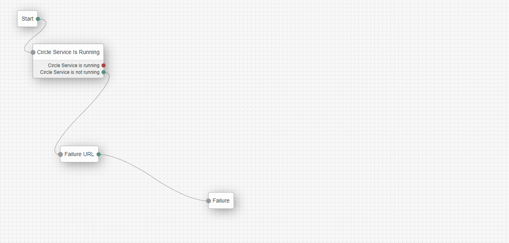
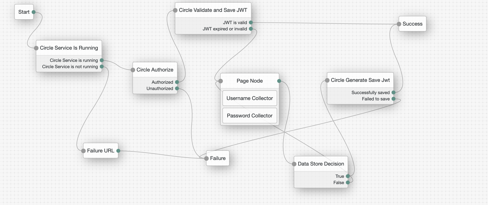
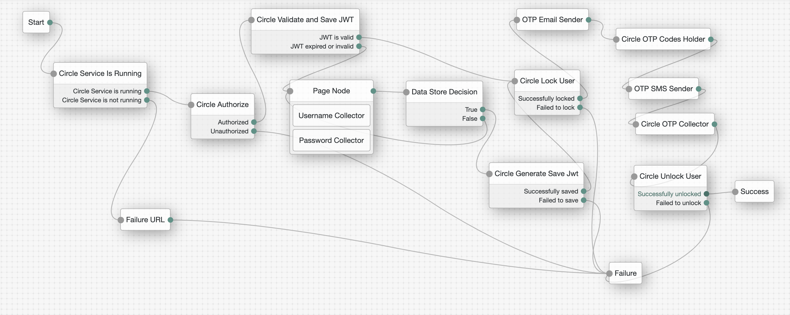

<!--
 *
 * Copyright 2021 Circle.
-->

# Circle Service
Circle Service allows ultra-secure client-side cross-browser storage of objects and files.
Unlike cookies which can be copied or manipulated, objects or files stored inside Circle Service can not be accessed or tempered.

# Circle Nodes for ForgeRock

A Circle Service node collection for ForgeRock Identity Platform 7.1.0 and above.  

## Getting the Circle Credentials
Please visit <a href="https://gocircle.ai">https://gocircle.ai</a> to get the credentials and download Circle Service upon registration.
 

## Installation

Copy the .jar file from the ../target directory into the ../web-container/webapps/app-name/WEB-INF/lib directory where AM is deployed.  Restart the web container to pick up the new nodes.  The nodes will then show up as tree components.

## To Build
run **mvn clean install** in the directory containing the pom.xml.

## Flows 
There are 2 different flows, each flow represents a ForgeRock Authentication Tree.

# Authentication Flow
The authentication flow performs the following operations:

- Verifies if the service is running locally

- Authorizes the usage of Circle Service by retrieving an authorization token from the Circle servers

- Checks if a JWT (JSON Web Token) is stored inside Circle Service. If so, it checks if it is valid (by checking the signature) and not expired, reads the username stored inside the token and stores it in sharedState for the next node

- If the JWT does not exist, it redirects to the username and password sign-in flow

- Once the credentials are valid, it generates a JWT, stores it securely in the Circle Service, and puts the username in the sharedState for the next node

## Circle Service is Running Node
This node checks if Circle Service is running on the local machine.

If the Circle Service is not installed, the user can be redirected to the Circle installation page.
Once the installation is complete, the user is automatically redirected back to the authentication flow.

Use a regular **Failure URL** node with the following content:

https://internal.gocircle.ai/api/installers/?return_url=<YOUR_SERVICE_URL>

The **return_url** parameter must point to the URL of the service execution, specifying the realm and the name of the service. The parameter must be an encoded URL. In this example it looks like this:

https://internal.gocircle.ai/api/installers/?return_url=https%3A%2F%2Fforgerock.gocircle.ai%3A8043%2Fam%2FXUI%2F%3Frealm%3Dcircle%26service%3Dauthentication

A helper tool for encoding URLs can  be found on this <a href="https://www.urlencoder.org/" target="_blank">page</a>

### The node provides 2 outcomes:
- Circle Service is Running 
- Circle Service is not Running

## Circle Authorize Node
This node Authorizes the usage of Circle Service by getting a Token from the Circle Servers. The Token is added to the sharedState and passed to the **ALL OTHER CIRCLE NODES**.

### The node provides 2 outcomes
- Authorized   
- Unauthorized

### Node settings
- **App Key** The App Key provided by Circle upon registration
- **Secret** The Secret provided by Circle  upon registration
- **Customer Code** The Customer code provided by Circle upon registration
- API URL (the default Circle API URL.)

 
## Circle Validate and Save JWT Node
This node checks if a JWT (JSON Web Token Authentication) is stored in Circle, if it is valid, and not expired. If the token is valid, the username stored in the token is read and stored in the sharedState for the next node.

### Node settings
- **Secret** The Secret provided by Circle upon registration

### The node provides 2 outcomes
- JWT is valid
- JWT expired or invalid

 
## Circle Credentials Checker Node
This node reads the username and password from the sharedState and verifies the validity of the username and password using a <a href="https://backstage.forgerock.com/docs/am/7.1/oauth2-guide/oauth2-register-client.html">OAuth 2.0 client</a>.

### Node settings
- **OAuth2 Access Token Endpoint** The OAuth 2.0 access token endpoint

 ### The node provides 2 outcomes
- Credentials found
- Credentials not found

 
## Circle Generate Save JWT Node

This node reads the **username** from the sharedState, creates the JWT with the secret and stores it in the Circle Service.

### Node settings
- **Secret** The Secret provided by Circle upon registration
- **Expiry time (days)** The token expiracity

### The node provides 2 outcomes
- Successfully saved
- Failed to save

# Reauthentication Flow

This flow demonstrates the use of OTP (One-Time Password) with Circle Service.
For example: It is possible to lock the user and generate unlock codes that can be sent to the email and/or SMS of person in charge. The user must then contact that person to obtain the unlock codes.

The process starts the same way as the authentication flow. Nodes are added to lock and unlock the user.

## Circle Lock User Node
This node locks the user and stores the unlock codes into the transientState.

### Node settings
- **Circle Private Key** Private key received upon registration

### The node provides 2 outcomes
- Successfully locked
- Failed to lock

## Circle OTP Codes Holder Node
This node holds the second unlock code in the transienteState {oneTimePassword} 

## Circle OTP Collector Node
This node presents a screen with 2 inputs for entering the unlock codes. The codes are stored in the sharedState.

## Circle Unlock User Node
This node reads the unlock codes from the sharedState ({code 1} and {code 2}) and, if the codes are correct, unlocks the user.

### The node provides 2 outcomes
- Successfully unlocked
- Failed to unlock

